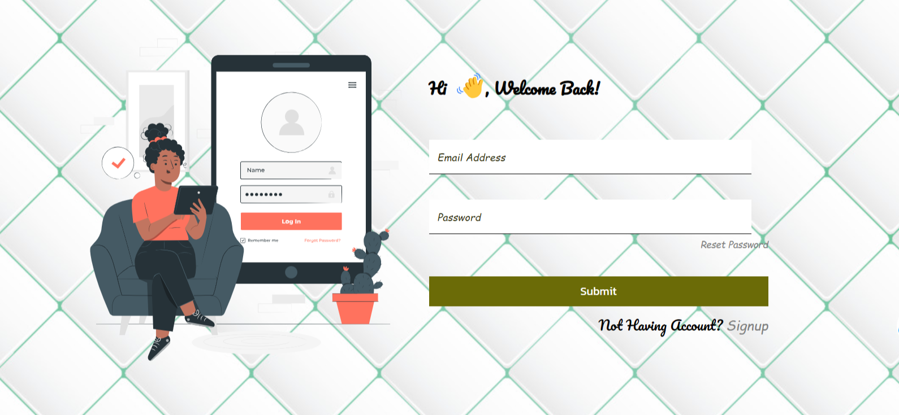

# MERN Blog App

## Description

The MERN Blog App is a full-stack blogging application built using the MERN stack (MongoDB, Express.js, React, Node.js). This application allows users to create, read, update, and delete blog posts. It also includes user authentication and authorization, allowing users to register and log in to manage their own posts..

## Images

### Login Form



### Signup Form


### Home Page


## Features

- **User Authentication:** Register, Login, Logout
- **CRUD Operations:** Create, Read, Update, and Delete blog posts
- **User-specific Post Management:** Users can manage their own posts
- **Responsive Design:** Ensures usability across various devices

## Technologies Used

### Frontend

- **React:** A JavaScript library for building user interfaces
- **Redux:** State management library
- **Axios:** Promise-based HTTP client
- **CSS:** Styling

### Backend

- **Node.js:** JavaScript runtime built on Chrome's V8 JavaScript engine
- **Express.js:** Web framework for Node.js

### Database

- **MongoDB:** NoSQL database
- **Mongoose:** MongoDB object modeling tool

### Authentication

- **JSON Web Tokens (JWT):** For secure user authentication
- **bcrypt:** For password hashing

## Installation

### Prerequisites

- **Node.js:** Install from [Node.js official website](https://nodejs.org/)
- **MongoDB:** Install from [MongoDB official website](https://www.mongodb.com/)

### Steps

1. **Clone the repository:**

   ```sh
   git clone https://github.com/DeveloperWilliams/MERN-Blog-App.git
   cd mern-blog-app

   ```

2. **Install dependencies for both frontend and backend:**

   ```sh
   cd client
   npm install
   cd ../server
   npm install
   ```

3. **Set up environment variables:**

   PORT=5000
   MONGODB_URI=<Your-MongoDB-URI>
   JWT_SECRET=<Your-JWT-Secret>

4. **Run the application:**

   ```sh
   cd server
   npm install
   npm start
   ```

   Terminal two

   ```sh
    cd server
    npm install
    npm start
   ```


## Contributing

We welcome contributions from the community! If you'd like to contribute, please follow these steps:

1. Fork the repository to your own GitHub account.
2. Clone the forked repository to your local machine.
3. Create a new branch with a descriptive name for your feature or bug fix.
4. Make your changes and commit them with clear and descriptive commit messages
5. Push your changes to your forked repository.
6. Open a Pull Request to the main repository, providing a detailed description of your changes and the problem they solve.

Please make sure your code adheres to my coding standards and passes all tests. Thanks!


## License

This project is licensed under the MIT License 
